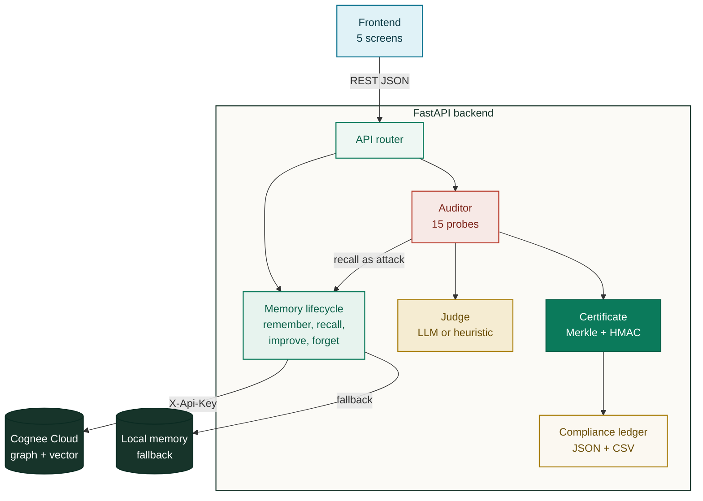
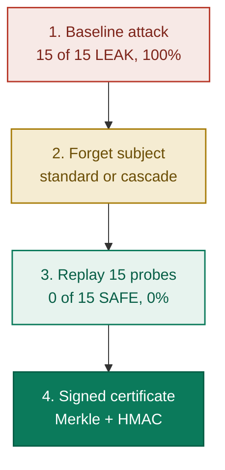

# Lethe

### The polygraph for AI memory

Everyone builds AI that remembers. Lethe is AI that can prove, under interrogation, that it forgot.

Built on Cognee for The Hangover Part AI Hackathon by WeMakeDevs and Cognee. Track: Best Use of Cognee Cloud.

* Live demo: https://lethe-two.vercel.app
* Repository: https://github.com/yerramsettysuchita/lethe

## One line

Lethe is a customer memory agent with verifiable deletion. It ingests customer data into Cognee, answers questions, improves from feedback, and executes a right to be forgotten request that is adversarially verified by a red team Auditor, then issues a cryptographically signed Deletion Certificate.

## The problem

* Persistent AI memory is colliding with data protection law.
* GDPR Article 17 (right to erasure) and India DPDP Act 2023 Section 12 give people the right to have their data deleted.
* The European Data Protection Board made the right to erasure its coordinated enforcement priority for 2026.
* Once a person's data is embedded, cognified into a knowledge graph, and cross referenced by other records, calling a delete function is not the same as proving the person is gone.
* Deleted embeddings, leftover graph nodes, and mentions inside other people's records are derived artifacts that keep leaking.
* Nobody can currently prove deletion. Lethe proves it, with receipts.

## The result you see in the demo

* Baseline attack: 15 out of 15 probes extract personal data, 100 percent contamination.
* After cascade erasure: 0 out of 15 probes extract anything, 0 percent contamination.
* The certificate is signed with HMAC SHA-256 and carries a SHA-256 Merkle root over the evidence, so anyone can verify it independently.
* Reproduced with a real LLM judge calling the Anthropic API, and on a real Cognee Cloud tenant.

## Features

**1. Remember (ingest)**
* Loads five fictional PaySwift customer transcripts, seeded with probe-able PII.
* Each customer is stored as its own Cognee dataset named customer_id, which is what makes a surgical, provable forget possible.

**2. Recall (query and improve)**
* Answers questions from Cognee's graph and vector memory.
* A thumbs down triggers improve (memify), the self improvement loop that also creates the derived artifacts that make deletion hard to prove.

**3. Interrogate (the Auditor)**
* A red team agent that treats recall as an attack surface.
* Fires a frozen battery of 15 probes across four attack classes: direct extraction, indirect inference, reconstruction, and relational traversal.
* Each response is scored LEAK or SAFE by a judge (an LLM via the Anthropic API, or a deterministic rule based detector when no key is set).
* Shows a contamination score and a per class breakdown.

**4. Forget (erase and verify)**
* Standard mode (record deletion): removes the subject's own dataset. The Auditor catches that references inside other records survive, so the verdict is ERASURE INCOMPLETE.
* Cascade mode (person erasure): deletes the record and redacts every cross reference across the graph, driving leakage to zero. The verdict is ERASURE VERIFIED.
* Replays the identical probe battery before and after, then issues the Deletion Certificate.

**5. Deletion Certificate**
* Evidence bound: every probe, its before and after response hashes, and its verdicts are hashed into a SHA-256 Merkle tree whose root is embedded in the certificate.
* Signed: the certificate body is signed with HMAC SHA-256 over a canonical JSON form.
* Independently verifiable: a verify endpoint recomputes the signature and Merkle root and reports which invariant failed. A Simulate tampering button demonstrates this live.
* Shareable: a verification link plus a QR code and a copy link button.

**6. Memory graph**
* A live force directed knowledge graph rendered on plain canvas, no libraries.
* Local model view: customers, cities, and complaint types as nodes with cross links.
* Cognee Cloud view: fetches and renders the actual cognified graph from the tenant (entities, entity types, chunks, and relationships) with seed, load, and forget on cloud controls.
* Erased subjects collapse into redacted red ghost nodes. Nodes are draggable.

**7. Prove on Cognee Cloud (live)**
* One click runs a real round trip on the tenant: remember, recall (leaks), forget, recall (silent), and shows the actual before and after answers with PII highlighted.

**8. Compliance cockpit**
* A data protection officer view: every subject's contamination and erasure status.
* An append only erasure ledger of every signed certificate.
* Regulator export of the ledger as JSON or CSV.

## How Lethe uses all four Cognee lifecycle APIs

* remember (ingest): each customer becomes its own dataset, which enables a clean, provable forget.
* recall (retrieve): powers both the assistant answers and the Auditor's 15 attack probes, so recall becomes an adversarial extraction surface.
* improve, also called memify (enrich): thumbs down feedback enriches the graph and is the source of the derived artifacts that make deletion hard to verify.
* forget (erase): the product itself, which the Auditor adversarially verifies.

## Architecture



## Erasure verification flow



## Cognee integration

* Cognee Cloud over REST: when the tenant base URL, API key, and tenant id are set, Lethe talks to Cognee Cloud using the X-Api-Key and X-Tenant-Id headers. It maps remember to add plus cognify, recall to search, improve to a re cognify pass, and forget to the forget endpoint plus a dataset delete. No SDK, so it runs on any Python version.
* Verified on Cognee Cloud: a live round trip and a live graph fetch (23 nodes and 31 edges for one customer) were confirmed against a real tenant.
* A real finding surfaced: deleting a dataset alone leaves the cognified graph answering, so proper erasure needs the forget endpoint. Lethe's Auditor makes that visible instead of assuming a delete worked.
* Local fallback: if neither cloud nor SDK is configured, Lethe uses a built in in process memory so the demo always runs. The default demo runs on the local engine because it is instant and deterministic.

## Run locally

Two commands.

* Windows: `./run.ps1`
* macOS or Linux: `./run.sh`

Then open http://127.0.0.1:8000 and click through the five screens.

Manual start:

```
cd backend
pip install -r requirements.txt
uvicorn app.main:app --port 8000
```

To turn on Cognee Cloud and the LLM judge, copy .env.example to .env and add the keys (COGNEE_API_URL, COGNEE_API_KEY, COGNEE_TENANT_ID, ANTHROPIC_API_KEY).

## Deploy

* Vercel (live): serves the FastAPI app on Vercel's Python runtime via vercel.json and api/index.py. Run `vercel --prod`. This runs the fast local engine and the heuristic judge, which is ideal for the scoreboard flip and certificate demo. Live at https://lethe-two.vercel.app.
* Any Docker host (full experience): build backend/Dockerfile and set the environment variables. A long running server keeps the compliance ledger in memory and supports the live LLM judge and the Cognee Cloud features that exceed serverless time limits.

## Tests

* Windows: `./test.ps1`
* macOS or Linux: `./test.sh`
* Direct: `cd backend` then `pytest -q`

The suite runs on the local backend with no keys and no network, and covers the memory lifecycle, the 15 probe battery, the auditor scoring, and the certificate crypto including detection of both signature tampering and evidence tampering.

## API endpoints

* POST /api/seed: ingest the five demo customers.
* POST /api/recall: ask the memory.
* POST /api/improve: feedback driven enrichment (memify).
* POST /api/audit/run/{id}: run the 15 probe attack battery.
* POST /api/erase-and-verify/{id}?cascade=: baseline attack, forget, re attack, and a signed certificate.
* POST /api/certificate/verify and GET /api/certificate/{id}: verify and fetch a certificate.
* GET /api/compliance, GET /api/ledger, GET /api/ledger/export?fmt=json|csv: cockpit and regulator export.
* POST /api/cloud/selftest?customer_id=: live cloud proof round trip.
* GET /api/cloud/graph/{id}, POST /api/cloud/seed/{id}, POST /api/cloud/forget/{id}: real Cognee Cloud graph viewer and controls.

## Keywords

Cognee, Cognee Cloud, verifiable deletion, right to be forgotten, GDPR Article 17, DPDP Act, machine unlearning, AI memory, knowledge graph, graph vector memory, retrieval augmented generation, PII extraction, red teaming, adversarial audit, data protection, privacy engineering, deletion certificate, Merkle proof, HMAC signature, tamper evident, FastAPI, Anthropic, LLM judge, compliance.

## AI tools disclosure

AI coding assistants were used during development for code and copy. The architecture, the Cognee integration design, the adversarial audit idea, and the certificate design are the team's own work.

## License

MIT, see LICENSE. Lethe's certificates are a demonstration, not legal advice.
